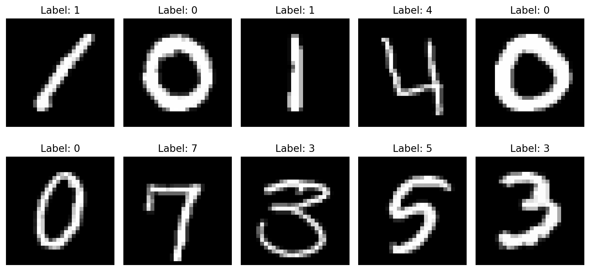
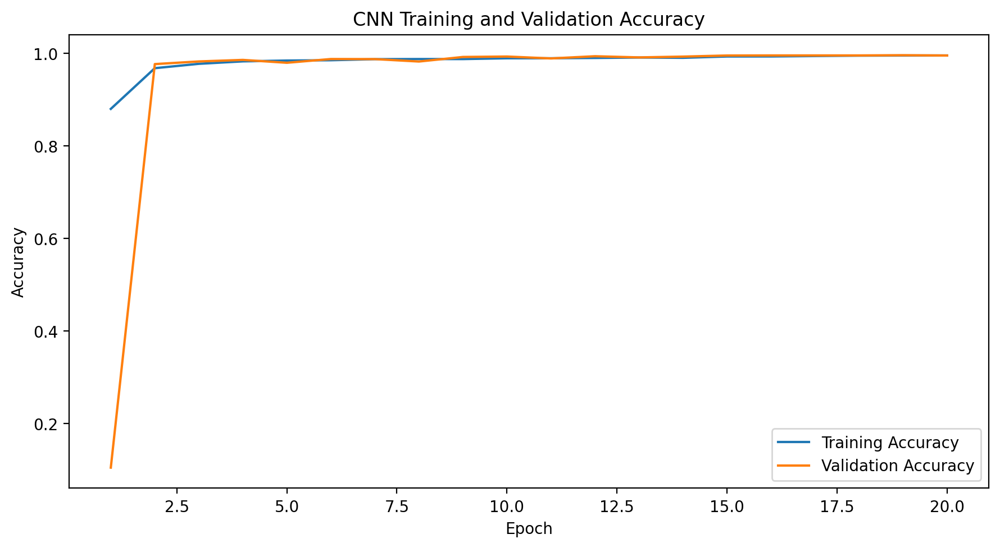

## Digit Recognizer

- 训练集大小： (42000, 785)
- 测试集大小： (28000, 784)
- 提交示例大小： (28000, 2)

## 给的data文件中分别有什么

#### train.csv：训练集

- 一共有 42,000 张手写数字图片；
- 每一行代表一张图片；
- 每行有 785 列。

785列包括：label + pixel0 + pixel1 + ... + pixel783

- label ：这张图片实际是数字几
- pixel0～pixel783 ：图片的784个像素值

举例，某一行可能是：
label = 5
pixel0 = 0
pixel1 = 0
pixel2 = 0
……
pixel783 = 0

表示：这一行对应的图片是数字5，后面784个数记录了图片的像素。

图片在CSV中并不是以真正的图片形式保存，而是被拆成了784个数字。

一张28×28的图片原本类似于：
第1行：28个像素；
第2行：28个像素；
第3行：28个像素；
……
第28行：28个像素

保存到CSV后，它被拉平成一行：pixel0, pixel1, pixel2, ..., pixel783

像素值范围一般是：0～255

- 0     表示黑色
- 255   表示白色
- 中间值 表示不同深浅的灰色

每张图片大小为：28 * 28

像素总数是：28 * 28 = 784

#### test.csv：测试集

一样，测试集大小：(28000, 784)

## 02_visualize_digits

- 像素数据大小： (42000, 784)
- 像素最小值： 0
- 像素最大值： 255

该代码主要作用：

#### 1）单独取出 label 列（它保存的是每张图片的正确答案） ，并分离标签和像素

#### 2）将图片的784个像素恢复成28×28图片，并显示

## 03_train_baseline（逻辑回归）

这部分代码主要流程：

#### 1）像素归一化
将原始像素范围从 0 - 255 变为 0 - 1

#### 2）划分训练集和验证集
原来的42,000张图片被分成：
- 80%训练集：33,600张
- 20%验证集：8,400张

X_train + y_train ：用于模型学习

X_valid ：交给模型预测

模型预测结果和y_valid比较 ，得到准确率

#### 3）创建逻辑回归模型（LogisticRegression）

#### 4）训练模型
model.fit(X_train, y_train)

#### 5）在验证集上进行预测
valid_predictions = model.predict(X_valid)

#### 6）计算准确率
accuracy = accuracy_score(y_valid, valid_predictions)

准确率的计算公式：预测正确的图片数量 ÷ 验证图片总数量

## 05_train_svm（RBF 核支持向量机 SVM）

RBF 核支持向量机，英文是 RBF Support Vector Machine，简称 RBF-SVM

#### 1）什么是 SVM支持向量机（解决二分类问题）
假设每张图片只有两个特征，例如：特征1：中间竖线的明显程度 ；特征2：顶部横线的明显程度

SVM要做的事情就是：找到一条分界线，把不同类别的数据尽量正确地分开。
它不只是随便找一条线，而是会寻找一条距离两边数据都尽可能远的分界线。

#### 2）最大间隔
分界线与两边最近的样本之间距离最大

#### 3）支持向量机
真正决定分界线位置的，并不是所有训练图片，而是最靠近分界线的那些图片。

这些关键样本叫：支持向量 Support Vectors

主要依靠边界附近的关键样本，确定不同类别之间的分界线。

#### 4）但是有的时候一条直线不一定能分开所有样本，因此引入：RBF核

kernel="rbf" —— 表示使用 RBF核函数。

Radial Basis Function ：径向基函数

它的核心作用是：把原来无法用直线分开的数据，转换到一个更高维的空间，使它们更容易被分开。

二维用直线分不开的数据，RBF核把中间区域向上提起来，在三维空间中使用一个平面分开

#### 5）RBF-SVM怎样判断两张图片是否相似？

对于两张手写数字图片，模型会比较它们784个像素之间的差异。

例如两张数字3，他们具有以下特征：
整体轮廓相似；
右侧弯曲位置相似；
左侧大部分为空；
像素分布较接近

它们在特征空间中的距离通常比较近。

而数字3与数字1：

笔画位置差别很大；
像素分布差别较大

距离通常比较远。

RBF核会把这种距离转化成相似程度：
- 距离越近 → 相似度越高
- 距离越远 → 相似度越低

模型在识别一张新图片时，会结合它与支持向量之间的相似程度，判断它更像哪个数字

#### 6）SVM最初主要用于二分类问题，如何处理10个数字

SVC 内部会把多分类任务拆成多个两两分类问题

## 07_train_cnn（CNN卷积神经网络）

- 读取train.csv
- 分离图片像素和正确标签
- 像素归一化到0～1
- 784个像素恢复成28×28图片
- 划分训练集和验证集
- 对训练图片进行轻微数据增强
- CNN提取数字的局部和整体特征
- 输出0～9十个类别的概率
- 用验证集检查准确率
- 保存验证效果最好的模型

#### 1）数据增强

layers.RandomRotation(...)

layers.RandomTranslation(...)

layers.RandomZoom(...)

它们会在模型训练期间，对图片进行轻微的随机变化。

数据增强相当于告诉模型：数字稍微移动、旋转或缩放之后，仍然是同一个数字。

从而提高模型的泛化能力

#### 2）卷积层 Conv2D 是什么

layers.Conv2D(
    filters=32,
    kernel_size=(3, 3),
    padding="same",
    activation="relu"
)

意思：使用32个不同的3×3小窗口，在整张28×28图片上滑动，寻找不同的局部图像特征。

卷积窗口会依次观察图片中的局部区域

不同卷积核可能学习不同内容

#### 3）filters=32 是什么？
表示这一层使用32个不同的卷积核，也就是学习32种不同的局部特征。

#### 4）为什么使用多层卷积？
32个卷积核（浅层） —— 64个卷积核（中层） —— 128个卷积核（深层）

#### 5）ReLU激活函数

ReLU的作用：保留有用的正数特征，把负数变成0。

加入ReLU后，模型才能学习更加复杂的非线性关系，例如数字3和8之间复杂的形状差异。

#### 6）BatchNormalization
批归一化，简称BN

它会对神经网络中间层的输出进行调整，使数值分布更加稳定。

每学完一步，都把中间数据重新整理到比较合理的范围内，避免数值忽大忽小。

#### 7）最大池化 MaxPooling2D 是什么？

layers.MaxPooling2D(pool_size=(2, 2))

它会把相邻的2×2区域压缩成一个值，并保留其中最大的值。

最大池化的作用：
- 减少数据量
- 降低计算量
- 保留最明显的特征
- 减少对精确像素位置的依赖

例如数字稍微向左移动一个像素，池化后提取到的整体特征可能仍然相似。

因此模型对数字轻微位置变化会更稳定。

#### 8）Dropout丢弃法

Dropout只在训练阶段生效。

如：layers.Dropout(0.35)

表示每次训练时，随机暂时关闭约35%的神经元。

作用：防止模型过度依赖某些固定特征，提高模型的泛化能力

#### 9）GlobalAveragePooling2D
layers.GlobalAveragePooling2D()

把每一张特征图取平均值。

假设最后有128张特征图，每张大小是7×7，那么它会把每张7×7特征图压缩成一个数字，这128个数字代表模型检测到的不同高级特征强度。

#### 10）全连接层 Dense

前面的卷积层负责找特征 ，全连接层负责根据这些特征作综合判断

#### 11）Softmax输出层

layers.Dense(
    units=10,
    activation="softmax"
)

units=10 是因为有10个数字类别

Softmax会输出10个概率，这些概率加起来等于1。

模型最终选择概率最大的类别作为结果：如：数字3的概率最高 ，所以预测结果是3

#### 12）该模型采用的损失函数：稀疏分类交叉熵损失

loss="sparse_categorical_crossentropy"

稀疏分类交叉熵损失

用于衡量： 模型预测概率 和 真实数字答案 之间有多大差距

#### 13）Adam优化器
Adam负责根据损失函数，更新神经网络中的参数。

#### 14）学习率
learning_rate=0.001

#### 15）ReduceLROnPlateau
keras.callbacks.ReduceLROnPlateau(
    monitor="val_loss",
    factor=0.5,
    patience=2
)

用于观察验证集损失

如果连续2轮没有明显改善，就把学习率变为原来的50%。

#### 16）EarlyStopping

keras.callbacks.EarlyStopping(
    monitor="val_loss",
    patience=5,
    restore_best_weights=True
)

如果验证集损失连续5轮都没有改善，就提前停止训练。

当模型没有进步时选择终止训练，防止过拟合

